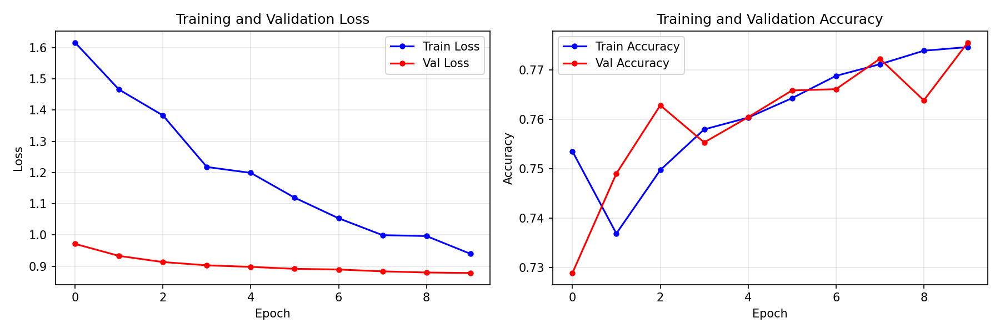
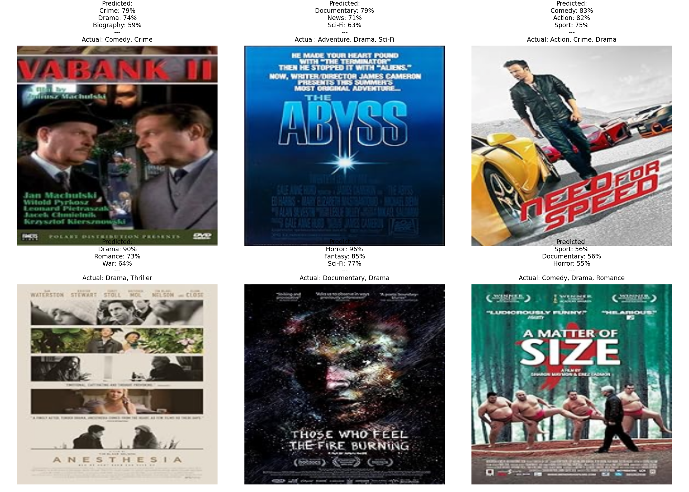

# Movie Poster Genre Classification

**Computer Vision · Multi-Label Classification · ResNet50 Fine-Tuning**

A solo CV project predicting movie genres from poster images.
The core challenge: **multi-label classification** (one movie can be both *Action* and *Sci-Fi*)
on a heavily imbalanced dataset of ~35k posters from IMDb via Kaggle.

---

## Results

Model trained for 10 epochs on ~28k posters across 25 genres.


*Loss and accuracy curves during training.*


*Sample predictions on the validation set.*

---

## Key Technical Decisions

**Weighted loss for class imbalance:**
Rare genres (*Western*, *Film-Noir*) are heavily underrepresented vs. common ones (*Drama*, *Comedy*). Applied `BCEWithLogitsLoss` with dynamically calculated `pos_weight` per class — makes the model "bolder" in predicting rare genres instead of ignoring them.

**Multi-threaded image download:**
`download_images.py` uses a thread pool to download ~35k poster images in parallel, automatically cleaning dead links and generating a sanitised `MovieGenre_clean.csv`.

**Interactive demo:**
The final section of `main.ipynb` lets you paste any direct image URL and get genre predictions in real time.

---

## Tech Stack

`Python` · `PyTorch` · `torchvision` (ResNet50) · `scikit-learn` · `pandas` · `Jupyter`

---

## Dataset

Source: [Movie Genre from its Poster](https://www.kaggle.com/datasets/neha1703/movie-genre-from-its-poster) on Kaggle (based on IMDb data).

The raw CSV files (`data/MovieGenre.csv`, `data/MovieGenre_clean.csv`) are included in this repo. The poster images (~432 MB) are downloaded locally by the script.

---

## Setup

```bash
# 1. Clone the repository
git clone https://github.com/kamilb222/movie-poster-classification.git
cd movie-poster-classification

# 2. Create virtual environment
python -m venv venv
source venv/bin/activate        # Windows: venv\Scripts\activate

# 3. Install dependencies
pip install -r requirements.txt

# 4. Download poster images (~35k, multi-threaded, takes a few minutes)
python download_images.py
# Creates: images/ folder and data/MovieGenre_clean.csv
```

---

## Usage

Open and run `main.ipynb` — it contains:
- Dataset loading and preprocessing
- ResNet50 fine-tuning with weighted loss
- Evaluation on the validation set
- **Interactive demo** — paste any poster image URL to get genre predictions

```bash
jupyter notebook main.ipynb
```

> **Demo tip:** the image URL must point directly to a `.jpg` or `.png` file.
> In Google Images: right-click → *Open Image in New Tab* → copy the URL.

---

## Project Structure

```
movie-poster-classification/
├── main.ipynb              # Training, evaluation, and interactive demo
├── dataset.py              # MoviePosterDataset — image loading + multi-label encoding
├── download_images.py      # Multi-threaded poster downloader + dead-link cleaner
├── requirements.txt
├── assets/
│   ├── training_history.png
│   └── predictions_grid.png
└── data/
    ├── MovieGenre.csv          # Original Kaggle dataset
    └── MovieGenre_clean.csv    # Cleaned version (auto-generated by download script)
```